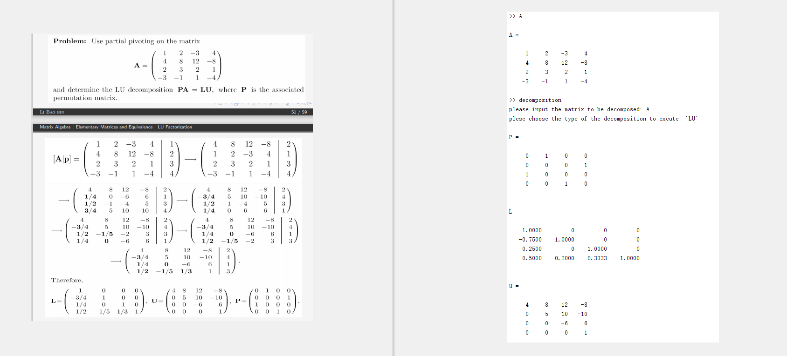
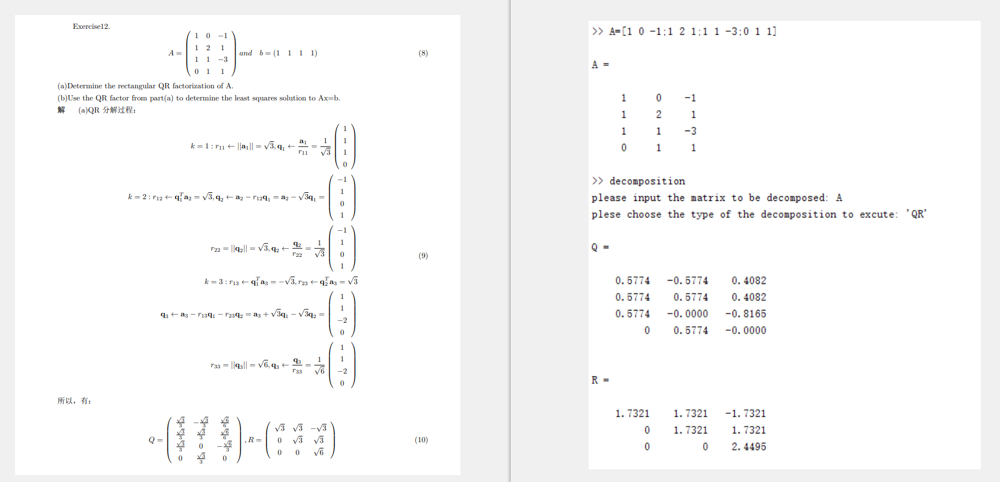
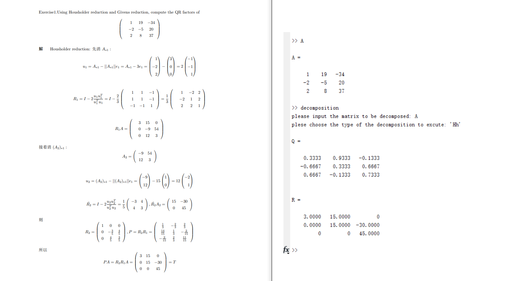
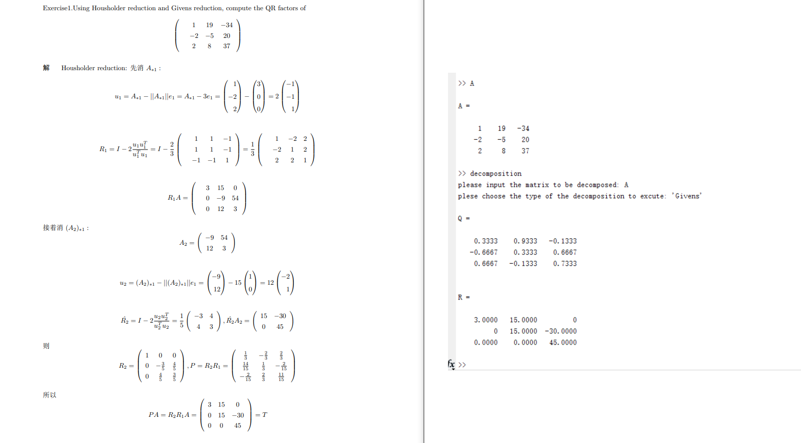
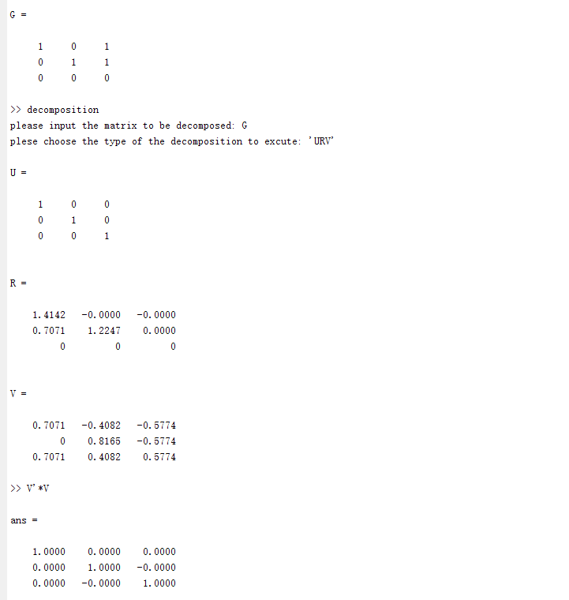

# README

## Table of Contents
### Background
    This is a trial of the algorithm implementation of five factorizations(LU, Gram Schmidt, Housholder, Givens and URV) after learning the analysis and application of matrix.
### Usage
    Run the decomposition.m, and then follow the tips to input the matrix and type of the decomposition respectively.
### Struct
    │  decomposition.m
    │  Givens.m
    │  Hh.m
    │  plu.m
    │  QR.m
    │  readme.md
    │  URV.m
    │  
    └─result
            Givens.png
            Hh.png
            PLU.png
            Schmidt.png
            URV.png
    其中6个m文件分别是主程序与5个分解的各自实现，其中LU分解最终实现的为PLU，即允许行交换的出现，适用范围更广；readme.md为说明文件；
    result文件夹中给出了5种分解的结果展示，其中
        PLU.png：使用的是课件中的例子，得到了与之相同的结果；
        Schmidt.png：使用了练习中的例子，结果的正确性得到了验证；
        Hh.png与Givens.png：使用了练习中的例子，均得到了正确的结果；
        URV.png：使用了网上找到例子，验证了U，V为正交矩阵，同时R去除右下方的零三角阵后为一个非奇异矩阵，满足定义，因此完成了对结果的正确性验证。
#### Result
PLU:

Schmidt:

Housholder:

Givens:

URV:
